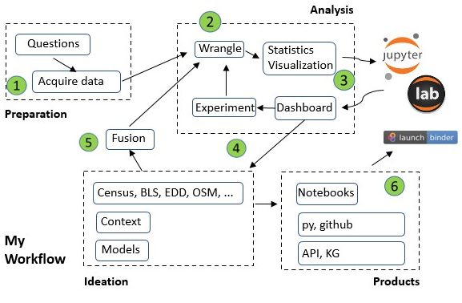

# Workshop Overview
This repository is a collection of notebooks, python modules, and data about small businesses in San Diego.  It demonstrates a workflow for analyzing and combining multiple content sources of the local community.  It is a starting point for two potential projects:

  1.  [Scalesd](https://scalesd.org) accelerator program supporting small businesses in San Diego.
  2.  [Sustainable Communities](https://model.earth/community/) web challenge sponsored by Code for Atlanta.
 
# Introduction - Data Science Workflow  
 

     
 

 

My `Data Science Workflow` covers the following steps:

1. The questons, and data, come from multiple sources.  They focus on local businesses and the communities where they operate.  Foundation data starts with [business firms](https://onedrive.live.com/edit.aspx?resid=1E5F39F3051216FA!217&cid=af24648a-ad9d-4a64-91f2-1c89990698c1&ithint=file%2cxlsx&wdOrigin=OFFICECOM-WEB.START.MRU) and [Business Improvement Districts](https://www.sandiego.gov/economic-development/about/bids).
2. Analysis is based on `Extract, Transform, Load/Link` (**wrangling**).  I use python and a variety of libraries to manipulate the data.  Important libraries used in the analysis include `pandas`, `geopandas`, and `numpy`.  As we refine the analysis, specific `questions` are answered, just as new ones are uncovered.
3. My development environment is `jupyter lab`.  Lab provides a rich environment for exploration.  I make use of multiple widget packages to analyze and visualize the data.  The key packages are `ipywidgets`, `ipyleaflet`, and `bqplot`.
4. As any analysis unfolds new questions are always uncovered.  This drives us to new and different sources of information for answers.  Part of our research is uncovering information sources to address these new questions.  Part of our understanding comes from applying different analytic techniques such as spatial, time series and crossfiltering.  Our motivation is always about adding more structure to the data we have!
5. As I develop analytic notebooks, I like to keep my eye out for opportunities develop packages/modules that can be shared.  I have one simple example in the src directory for NAICS.  As you look at the notebooks you should see examples of repetitive hacks.  These should be converted to code!  Techniques to link, fuse, and share are very important.
6. The work flow allows me to package, and document, the processes used in the analysis.  Notebooks (like this one) can be published and shared.  It provides a structured approach to uncovering details in the data, software interfaces for various services, and ultimately an approach to creating a structured knowledge repository supporting multiple projects.

This workshop demonstrates how these elements are combined for analysis and product development.

## Contents of the workshop repository

- Data directory contains the various csv and shape files

- Notebooks directory contains the initial notebooks available here 
- The order I'd recommend (sort of) at first glance:
   - `preparation.md` - Markdown description of questions and data sources
   - `wrangling.ipynb` - Primary notebook to process the business csv
   - `naics.ipynb` - A deep dive on NAICS codes
   - `query.ipynb` - A scratch pad to play with different queries (more to come on this one)
   - `El Cajon Blvd BID.ipynb` - Visualize the [boulevard BID](https://theboulevard.org/)
   - `tldr.ipynb` - Jumping to the end first?

This is just the starting point.  There is much more to do!